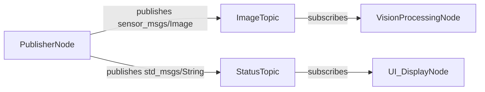
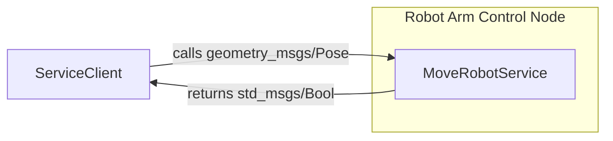

# Chapter 2: ROS 2 Nodes, Topics, and Services

In the previous chapter, we introduced ROS 2 as the Robotic Nervous System, emphasizing its role in facilitating communication between various components of a robotic system. Now, we'll dive deeper into the fundamental building blocks of ROS 2 communication: Nodes, Topics, and Services. Understanding these concepts is crucial for designing, implementing, and debugging any ROS 2-based robotic application, especially for complex humanoid systems.

## Deep Dive into ROS 2 Nodes

A **Node** is the smallest executable unit in ROS 2. Each node is responsible for performing a single, well-defined task within the robotic system. By breaking down complex functionalities into smaller, independent nodes, ROS 2 promotes modularity, reusability, and easier debugging.

**What they are:**
*   **Independent processes:** Nodes run as separate executables.
*   **Encapsulate functionality:** Each node typically performs one logical function (e.g., a camera driver node, a navigation node, a speech synthesis node).
*   **Communicate via ROS mechanisms:** Nodes interact with each other using Topics, Services, Actions (covered later), and Parameters.

**How to create them (Conceptual steps):**
1.  **Initialize ROS 2 client library:** Use `rclpy.init()` for Python or `rclcpp::init()` for C++.
2.  **Create a Node instance:** Instantiate a `Node` object, giving it a unique name within the ROS graph.
3.  **Implement node logic:** Define what the node does (e.g., publish data, subscribe to data, offer a service).
4.  **Spin the node:** `rclpy.spin()` or `rclcpp::spin()` keeps the node alive, allowing it to process callbacks for incoming messages or service requests.
5.  **Shutdown:** Properly destroy the node and shut down the ROS 2 client library.

**Example: A Simple Publisher Node (in Python using `rclpy`)**

Let's create a node that continuously publishes "Hello, Humanoid!" messages to a topic.

First, ensure you have ROS 2 installed and sourced. Create a new ROS 2 package:
```bash
ros2 pkg create --build-type ament_python simple_publisher_pkg
```

Inside `simple_publisher_pkg/simple_publisher_pkg/` (create the directory if it doesn't exist), create a Python file named `talker.py`:

```python
import rclpy
from rclpy.node import Node
from std_msgs.msg import String # Standard message type for strings

class SimplePublisher(Node):
    def __init__(self):
        super().__init__('simple_publisher')
        self.publisher_ = self.create_publisher(String, 'chatter', 10) # Topic name 'chatter', queue size 10
        self.timer = self.create_timer(0.5, self.timer_callback) # Publish every 0.5 seconds
        self.i = 0
        self.get_logger().info('Simple Publisher Node has started.')

    def timer_callback(self):
        msg = String()
        msg.data = f'Hello, Humanoid! {self.i}'
        self.publisher_.publish(msg)
        self.get_logger().info(f'Publishing: "{msg.data}"')
        self.i += 1

def main(args=None):
    rclpy.init(args=args)
    simple_publisher = SimplePublisher()
    rclpy.spin(simple_publisher) # Keep the node alive
    simple_publisher.destroy_node()
    rclpy.shutdown()

if __name__ == '__main__':
    main()
```

Modify `simple_publisher_pkg/setup.py` to include your executable:
```python
from setuptools import find_packages, setup

package_name = 'simple_publisher_pkg'

setup(
    name=package_name,
    version='0.0.0',
    packages=find_packages(exclude=['test']),
    # ... other data_files etc.
    install_requires=['setuptools'],
    zip_safe=True,
    maintainer='Your Name',
    maintainer_email='your.email@example.com',
    description='Simple publisher node example',
    license='Apache-2.0',
    tests_require=['pytest'],
    entry_points={
        'console_scripts': [
            'talker = simple_publisher_pkg.talker:main',
        ],
    },
)
```

Build and run:
```bash
colcon build --packages-select simple_publisher_pkg
source install/setup.bash
ros2 run simple_publisher_pkg talker
```

## Topics: Publish-Subscribe Model

**Topics** are the primary mechanism for asynchronous, many-to-many communication in ROS 2. They implement a **publish-subscribe** messaging pattern.

**How it works:**
*   **Publishers:** Nodes that send data to a specific topic.
*   **Subscribers:** Nodes that receive data from a specific topic.
*   **Decoupled:** Publishers and subscribers don't know about each other directly. They only need to agree on the topic name and the message type.
*   **Continuous streams:** Topics are ideal for streaming data, such as sensor readings (camera images, lidar scans, joint states) or continuous commands.

**Message Types:**
Every message published on a topic has a defined **message type**. This ensures that both publishers and subscribers understand the structure and meaning of the data. Message types are defined using `.msg` files and automatically generate code in various languages.
Common message types are found in packages like `std_msgs` (e.g., `String`, `Int32`), `sensor_msgs` (e.g., `Image`, `PointCloud2`), `geometry_msgs` (e.g., `Point`, `Twist`).

**`ros2 topic` commands:**
The ROS 2 CLI provides powerful tools for inspecting topics:
*   `ros2 topic list`: Lists all active topics.
*   `ros2 topic info <topic_name>`: Shows publisher/subscriber counts and message type.
*   `ros2 topic echo <topic_name>`: Displays messages being published on a topic in real-time.
*   `ros2 topic pub <topic_name> <msg_type> '<msg_data>'`: Manually publish a single message.

**Example: A Simple Subscriber Node (in Python using `rclpy`)**

Let's create a node that subscribes to the "chatter" topic from our `SimplePublisher` node.

Inside `simple_publisher_pkg/simple_publisher_pkg/`, create a Python file named `listener.py`:

```python
import rclpy
from rclpy.node import Node
from std_msgs.msg import String

class SimpleSubscriber(Node):
    def __init__(self):
        super().__init__('simple_subscriber')
        self.subscription = self.create_subscription(
            String,
            'chatter',
            self.listener_callback,
            10) # Topic name 'chatter', queue size 10
        self.get_logger().info('Simple Subscriber Node has started.')

    def listener_callback(self, msg):
        self.get_logger().info(f'I heard: "{msg.data}"')

def main(args=None):
    rclpy.init(args=args)
    simple_subscriber = SimpleSubscriber()
    rclpy.spin(simple_subscriber)
    simple_subscriber.destroy_node()
    rclpy.shutdown()

if __name__ == '__main__':
    main()
```

Modify `simple_publisher_pkg/setup.py` again to add the `listener` executable:
```python
# ... inside entry_points
    entry_points={
        'console_scripts': [
            'talker = simple_publisher_pkg.talker:main',
            'listener = simple_publisher_pkg.listener:main', # Add this line
        ],
    },
```

Build and run both nodes in separate terminals:
Terminal 1:
```bash
colcon build --packages-select simple_publisher_pkg
source install/setup.bash
ros2 run simple_publisher_pkg talker
```
Terminal 2:
```bash
source install/setup.bash
ros2 run simple_publisher_pkg listener
```
You should see the `listener` node receiving messages published by the `talker` node.

### Discussion on Quality of Service (QoS) Settings

ROS 2's Quality of Service (QoS) policies define how messages are exchanged between publishers and subscribers. These settings are crucial for ensuring reliable communication, especially in real-time robotic applications. Key QoS policies include:

*   **History**: How many samples to keep in the queue (e.g., `keep_last` for latest, `keep_all` for all).
*   **Depth**: The size of the history queue.
*   **Reliability**: Whether messages are guaranteed to arrive (`reliable`) or if some can be lost (`best_effort`).
*   **Durability**: Whether late-joining subscribers receive previously published messages (`transient_local`) or only future messages (`volatile`).
*   **Liveliness**: How publishers assert they are still alive.

For most robotic applications, especially those dealing with sensor data, `best_effort` reliability with `keep_last` history is common to prioritize freshness over guaranteed delivery. For critical commands, `reliable` is preferred.

## Services: Request-Response Model

**Services** provide a synchronous, one-to-one communication mechanism for **request-response** interactions. They are ideal for operations that require an immediate result, such as querying a robot's state, triggering a specific action, or requesting a computation.

**How it works:**
*   **Service Server:** A node that "offers" a service. It waits for incoming requests, performs a computation, and sends back a response.
*   **Service Client:** A node that "calls" a service. It sends a request to a server and waits for the response.

**Service Types:**
Similar to message types, **service types** are defined using `.srv` files. A service type defines both the structure of the request message and the structure of the response message.
Example: `AddTwoInts.srv` might define a request with two integers and a response with their sum.

**`ros2 service` commands:**
*   `ros2 service list`: Lists all active services.
*   `ros2 service type <service_name>`: Shows the service type.
*   `ros2 service find <service_type>`: Finds services of a specific type.
*   `ros2 service call <service_name> <service_type> '<request_data>'`: Calls a service from the command line.

**Example: A Simple Service Server and Client (in Python using `rclpy`)**

Let's create a service that takes two integers and returns their sum.

First, define a custom service type. Inside your `simple_publisher_pkg` folder (NOT `simple_publisher_pkg/simple_publisher_pkg`), create a folder named `srv` and inside it, create `AddTwoInts.srv`:
```
int64 a
int64 b
---
int64 sum
```

Now, modify `simple_publisher_pkg/package.xml` to include dependencies for `rosidl_default_generators` and `rosidl_default_runtime`:
```xml
  <buildtool_depend>ament_cmake</buildtool_depend>
  <buildtool_depend>ament_python</buildtool_depend>
  <buildtool_depend>rosidl_default_generators</buildtool_depend> <!-- Add this -->
  <exec_depend>rosidl_default_runtime</exec_depend> <!-- Add this -->
```
Also, ensure `simple_publisher_pkg/setup.py` handles the service definition:
```python
from setuptools import find_packages, setup
import os
from glob import glob

package_name = 'simple_publisher_pkg'

setup(
    name=package_name,
    version='0.0.0',
    packages=find_packages(exclude=['test']),
    data_files=[
        ('share/' + package_name, ['package.xml']),
        (os.path.join('share', package_name, 'srv'), glob('srv/*.srv')) # Add this line
    ],
    install_requires=['setuptools'],
    zip_safe=True,
    maintainer='Your Name',
    maintainer_email='your.email@example.com',
    description='Simple publisher, subscriber, and service example',
    license='Apache-2.0',
    tests_require=['pytest'],
    entry_points={
        'console_scripts': [
            'talker = simple_publisher_pkg.talker:main',
            'listener = simple_publisher_pkg.listener:main',
            'add_server = simple_publisher_pkg.add_server:main', # Add server executable
            'add_client = simple_publisher_pkg.add_client:main', # Add client executable
        ],
    },
)
```

Inside `simple_publisher_pkg/simple_publisher_pkg/`, create `add_server.py`:
```python
import rclpy
from rclpy.node import Node
from simple_publisher_pkg.srv import AddTwoInts # Import your custom service type

class AddTwoIntsService(Node):
    def __init__(self):
        super().__init__('add_two_ints_server')
        self.srv = self.create_service(AddTwoInts, 'add_two_ints', self.add_two_ints_callback)
        self.get_logger().info('AddTwoInts Service Server has started.')

    def add_two_ints_callback(self, request, response):
        response.sum = request.a + request.b
        self.get_logger().info(f'Incoming request: a={request.a}, b={request.b}. Sending response: sum={response.sum}')
        return response

def main(args=None):
    rclpy.init(args=args)
    add_two_ints_service = AddTwoIntsService()
    rclpy.spin(add_two_ints_service)
    add_two_ints_service.destroy_node()
    rclpy.shutdown()

if __name__ == '__main__':
    main()
```

And `add_client.py`:
```python
import rclpy
from rclpy.node import Node
from simple_publisher_pkg.srv import AddTwoInts # Import your custom service type
import sys

class AddTwoIntsClient(Node):
    def __init__(self):
        super().__init__('add_two_ints_client')
        self.client = self.create_client(AddTwoInts, 'add_two_ints')
        while not self.client.wait_for_service(timeout_sec=1.0):
            self.get_logger().info('service not available, waiting again...')
        self.request = AddTwoInts.Request()

    def send_request(self, a, b):
        self.request.a = a
        self.request.b = b
        self.future = self.client.call_async(self.request)
        rclpy.spin_until_future_complete(self, self.future) # Wait for response
        return self.future.result()

def main(args=None):
    rclpy.init(args=args)
    if len(sys.argv) != 3:
        print('Usage: ros2 run simple_publisher_pkg add_client <int_a> <int_b>')
        rclpy.shutdown()
        sys.exit(1)

    add_two_ints_client = AddTwoIntsClient()
    response = add_two_ints_client.send_request(int(sys.argv[1]), int(sys.argv[2]))
    add_two_ints_client.get_logger().info(
        f'Result of add_two_ints: for {add_two_ints_client.request.a} + {add_two_ints_client.request.b} = {response.sum}'
    )
    add_two_ints_client.destroy_node()
    rclpy.shutdown()

if __name__ == '__main__':
    main()
```

Build and run the server in one terminal, then the client in another:
Terminal 1:
```bash
colcon build --packages-select simple_publisher_pkg
source install/setup.bash
ros2 run simple_publisher_pkg add_server
```
Terminal 2:
```bash
source install/setup.bash
ros2 run simple_publisher_pkg add_client 5 7
```
You should see the client receive the sum (12) from the server.

## Diagrams Illustrating Communication Patterns

**Topic Communication:**



**Service Communication:**



## Key Takeaways

*   **Nodes** are the fundamental executable units in ROS 2, encapsulating specific functionalities.
*   **Topics** implement a publish-subscribe model for asynchronous, continuous data streams, crucial for sensor data and constant state updates.
*   **Services** implement a request-response model for synchronous, one-time interactions, ideal for triggering actions or querying specific data.
*   **Message and Service Types** ensure data consistency and interoperability.
*   **QoS policies** allow fine-tuning communication reliability and behavior.
*   The ROS 2 CLI provides essential tools (`ros2 topic`, `ros2 service`) for inspecting and interacting with the ROS graph.