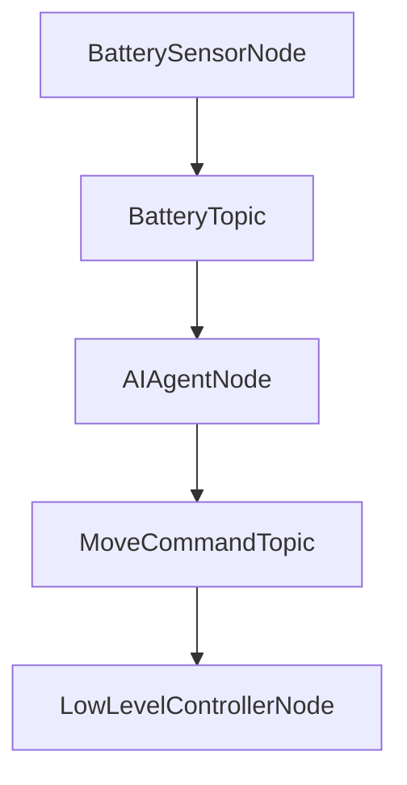

# Chapter 3: Bridging AI Agents with ROS using rclpy

The integration of Artificial Intelligence (AI) agents with robotic systems is a cornerstone of Physical AI. While AI agents often involve complex algorithms for perception, decision-making, and learning, robotic platforms like humanoid robots require a robust communication framework to execute the AI's directives and provide sensory feedback. This chapter focuses on `rclpy`, the Python client library for ROS 2, and how it serves as the essential bridge for AI agents to interact with the ROS 2 ecosystem.

## Introduction to `rclpy` and its role in Python-ROS 2 integration

`rclpy` is the official Python client library for ROS 2. It provides a Pythonic interface to all core ROS 2 functionalities, allowing developers to write ROS 2 nodes, publishers, subscribers, service clients, and service servers using Python. Its role is pivotal for AI development in robotics because:

*   **Ease of Use**: Python is a dominant language in AI and machine learning due to its simplicity, extensive libraries, and large community. `rclpy` allows AI developers to leverage their Python expertise directly within the ROS 2 framework.
*   **Rapid Prototyping**: Python's dynamic nature and `rclpy`'s straightforward API enable quick development and iteration of AI algorithms for robotic control.
*   **Integration with AI Frameworks**: `rclpy` nodes can easily integrate with popular AI libraries such as TensorFlow, PyTorch, scikit-learn, and OpenCV, as these are all Python-based.

In essence, `rclpy` enables AI agents written in Python to become first-class citizens in the ROS 2 graph, seamlessly sending commands to and receiving data from other robot components.

## How AI agents can publish sensor data and subscribe to command topics

An AI agent, especially one focused on high-level decision-making or perception, will typically engage with the ROS 2 graph in two primary ways:

1.  **Subscribing to Sensor Data Topics**: The AI agent needs to perceive the robot's state and its environment. This involves subscribing to ROS 2 topics that publish data from various sensors. Examples include:
    *   `sensor_msgs/Image` from cameras for computer vision tasks.
    *   `sensor_msgs/LaserScan` or `sensor_msgs/PointCloud2` from LiDAR/depth sensors for environment mapping and obstacle avoidance.
    *   `sensor_msgs/JointState` providing current joint positions, velocities, and efforts from the robot's actuators.
    *   `geometry_msgs/Pose` or `nav_msgs/Odometry` for the robot's estimated position and orientation.

2.  **Publishing Command Topics**: Based on its internal logic and processed sensor data, the AI agent will generate commands for the robot's actuators or other control systems. These commands are typically published to specific topics. Examples include:
    *   `geometry_msgs/Twist` for linear and angular velocity commands (e.g., for base locomotion).
    *   Custom message types for specific humanoid actions, like `humanoid_msgs/WalkCommand` or `humanoid_msgs/GraspObject`.
    *   `sensor_msgs/JointState` to command specific joint positions or efforts.

This publish-subscribe model ensures loose coupling, allowing AI agents to be developed and tested independently of the underlying hardware drivers or low-level controllers.

## Using `rclpy` to create custom nodes for AI agent interaction

Creating an `rclpy` node for an AI agent follows the same principles as any other ROS 2 node, but with a focus on its specific inputs (subscriptions) and outputs (publications).

Consider an AI agent that monitors the robot's battery level and, if it drops below a threshold, publishes a command to move the robot to a charging station.

**Conceptual Structure of an AI Agent Node:**



## Example: An AI agent node that subscribes to a "robot_status" topic and publishes "movement_commands"

Let's expand on the `simple_publisher_pkg` from Chapter 2 to simulate this interaction.

First, let's assume we have a `robot_status` topic that publishes a custom message type, `RobotStatus.msg`, and a `movement_command` topic using `geometry_msgs/Twist`.

Create `RobotStatus.msg` in a `msg` folder inside `simple_publisher_pkg`:
```
string status_message
float32 battery_percentage
bool is_charging
```

Update `simple_publisher_pkg/package.xml` to include `rosidl_default_generators` and `rosidl_default_runtime` dependencies, and `std_msgs` and `geometry_msgs` exec dependencies:
```xml
  <buildtool_depend>ament_cmake</buildtool_depend>
  <buildtool_depend>ament_python</buildtool_depend>
  <buildtool_depend>rosidl_default_generators</buildtool_depend>
  <exec_depend>rosidl_default_runtime</exec_depend>
  <exec_depend>std_msgs</exec_depend> <!-- Add this for String -->
  <exec_depend>geometry_msgs</exec_depend> <!-- Add this for Twist -->
```

Update `simple_publisher_pkg/setup.py` to handle the `RobotStatus.msg` definition:
```python
from setuptools import find_packages, setup
import os
from glob import glob

package_name = 'simple_publisher_pkg'

setup(
    name=package_name,
    version='0.0.0',
    packages=find_packages(exclude=['test']),
    data_files=[
        ('share/' + package_name, ['package.xml']),
        (os.path.join('share', package_name, 'srv'), glob('srv/*.srv')),
        (os.path.join('share', package_name, 'msg'), glob('msg/*.msg')) # Add this line
    ],
    install_requires=['setuptools'],
    zip_safe=True,
    maintainer='Your Name',
    maintainer_email='your.email@example.com',
    description='Simple publisher, subscriber, service, and AI agent example',
    license='Apache-2.0',
    tests_require=['pytest'],
    entry_points={
        'console_scripts': [
            'talker = simple_publisher_pkg.talker:main',
            'listener = simple_publisher_pkg.listener:main',
            'add_server = simple_publisher_pkg.add_server:main',
            'add_client = simple_publisher_pkg.add_client:main',
            'robot_status_publisher = simple_publisher_pkg.robot_status_publisher:main', # New
            'ai_agent_node = simple_publisher_pkg.ai_agent_node:main', # New
        ],
    },
)
```

Now, create `robot_status_publisher.py` (simulating sensor data) in `simple_publisher_pkg/simple_publisher_pkg/`:
```python
import rclpy
from rclpy.node import Node
from simple_publisher_pkg.msg import RobotStatus # Your custom message
import random

class RobotStatusPublisher(Node):
    def __init__(self):
        super().__init__('robot_status_publisher')
        self.publisher_ = self.create_publisher(RobotStatus, 'robot_status', 10)
        self.timer = self.create_timer(1.0, self.timer_callback)
        self.battery = 100.0
        self.is_charging = False
        self.get_logger().info('Robot Status Publisher started.')

    def timer_callback(self):
        msg = RobotStatus()
        
        # Simulate battery drain/charge
        if not self.is_charging:
            self.battery -= random.uniform(0.5, 2.0)
            if self.battery <= 10.0:
                self.is_charging = True
                msg.status_message = "Battery low, seeking charge."
            else:
                msg.status_message = "Operating normally."
        else:
            self.battery += random.uniform(3.0, 5.0)
            if self.battery >= 95.0:
                self.is_charging = False
                msg.status_message = "Battery charged, resuming operations."
            else:
                msg.status_message = "Charging battery."

        self.battery = max(0.0, min(100.0, self.battery)) # Clamp between 0 and 100

        msg.battery_percentage = self.battery
        msg.is_charging = self.is_charging
        self.publisher_.publish(msg)
        self.get_logger().info(f'Published: Battery: {msg.battery_percentage:.1f}%, Charging: {msg.is_charging}, Status: {msg.status_message}')

def main(args=None):
    rclpy.init(args=args)
    node = RobotStatusPublisher()
    rclpy.spin(node)
    node.destroy_node()
    rclpy.shutdown()

if __name__ == '__main__':
    main()
```

And `ai_agent_node.py` (your AI agent logic) in `simple_publisher_pkg/simple_publisher_pkg/`:
```python
import rclpy
from rclpy.node import Node
from simple_publisher_pkg.msg import RobotStatus
from geometry_msgs.msg import Twist # For movement commands

class AIAgentNode(Node):
    def __init__(self):
        super().__init__('ai_agent_node')
        self.subscription = self.create_subscription(
            RobotStatus,
            'robot_status',
            self.status_callback,
            10
        )
        self.publisher_ = self.create_publisher(Twist, 'movement_commands', 10)
        self.get_logger().info('AI Agent Node started.')
        self.low_battery_threshold = 20.0
        self.charging_station_found = False # Simulate finding a charging station

    def status_callback(self, msg: RobotStatus):
        self.get_logger().info(f'AI received status: Battery: {msg.battery_percentage:.1f}%, Charging: {msg.is_charging}, Status: {msg.status_message}')

        if msg.battery_percentage < self.low_battery_threshold and not msg.is_charging and not self.charging_station_found:
            self.get_logger().warn('Battery critically low! Initiating search for charging station.')
            self.publish_move_command(linear_x=0.2, angular_z=0.5) # Example: move and turn to find station
            self.charging_station_found = True # Simulate finding it after one command
        elif msg.is_charging:
            self.get_logger().info('Robot is charging, standing by.')
            self.publish_move_command(linear_x=0.0, angular_z=0.0) # Stop movement
            self.charging_station_found = False # Reset once charging
        elif self.charging_station_found and msg.battery_percentage >= self.low_battery_threshold + 5: # If it found one and battery improved a bit
            self.get_logger().info('Battery recovering, stopping search.')
            self.publish_move_command(linear_x=0.0, angular_z=0.0)
            self.charging_station_found = False
        else:
            self.get_logger().info('Battery OK. No specific AI action needed.')
            self.publish_move_command(linear_x=0.0, angular_z=0.0) # No movement if not needed

    def publish_move_command(self, linear_x, angular_z):
        twist_msg = Twist()
        twist_msg.linear.x = float(linear_x)
        twist_msg.angular.z = float(angular_z)
        self.publisher_.publish(twist_msg)
        self.get_logger().info(f'Published movement command: linear.x={linear_x}, angular.z={angular_z}')


def main(args=None):
    rclpy.init(args=args)
    ai_agent_node = AIAgentNode()
    rclpy.spin(ai_agent_node)
    ai_agent_node.destroy_node()
    rclpy.shutdown()

if __name__ == '__main__':
    main()
```

Build the package again:
```bash
colcon build --packages-select simple_publisher_pkg
source install/setup.bash
```

Run in separate terminals:
Terminal 1: `ros2 run simple_publisher_pkg robot_status_publisher`
Terminal 2: `ros2 run simple_publisher_pkg ai_agent_node`
Terminal 3 (optional, to see commands): `ros2 topic echo /movement_commands`

Observe how the `ai_agent_node` reacts to the simulated battery status and publishes movement commands.

## Integrating external AI libraries/frameworks (Conceptual)

The beauty of `rclpy` is that it allows you to embed sophisticated AI logic directly within your ROS 2 nodes. For instance:

*   **Computer Vision**: A node might subscribe to `sensor_msgs/Image`, process it using OpenCV or a pre-trained TensorFlow/PyTorch model (e.g., for object detection or pose estimation), and then publish detected objects to another topic or use them for internal decision-making.
*   **Reinforcement Learning**: An RL agent could have its policy implemented in a Python node. It would subscribe to state information (joint angles, sensor readings), decide on an action, and publish that action as motor commands.
*   **Natural Language Processing**: For human-robot interaction, an NLP node could subscribe to audio data, process it with libraries like `transformers`, and then publish high-level intent to a planning node.

## Challenges and Best Practices for AI-ROS Integration

**Challenges:**

1.  **Computational Overhead**: AI models can be computationally intensive. Running them directly within ROS 2 nodes might require powerful hardware or distributed computation.
2.  **Real-time Constraints**: Ensuring that AI inference happens within strict deadlines for robotic control can be difficult.
3.  **Data Management**: Handling large volumes of sensor data efficiently (e.g., high-resolution camera feeds) for AI processing.
4.  **Synchronisation**: Coordinating data from multiple asynchronous sensor streams for a coherent AI perception.

**Best Practices:**

1.  **Dedicated AI Nodes**: Isolate complex AI logic into dedicated nodes. This improves modularity and makes it easier to manage dependencies and resources.
2.  **Asynchronous Processing**: Utilize `rclpy`'s executor model (e.g., `MultiThreadedExecutor`) to allow AI processing to run in parallel with other node callbacks, preventing blocking.
3.  **Efficient Data Transfer**: Leverage ROS 2's `sensor_msgs` types and consider zero-copy transport (e.g., using shared memory for large data like images) to minimize overhead.
4.  **QoS Tuning**: Carefully select QoS policies for topics carrying AI-critical data to balance reliability, latency, and throughput.
5.  **Clear API Design**: Define clear ROS 2 message and service interfaces for AI nodes to communicate with the rest of the system.
6.  **Simulation for Testing**: Extensively test AI agents in simulation (e.g., Gazebo, Isaac Sim) before deploying to real hardware.

## Key Takeaways

*   `rclpy` is the crucial Python client library for integrating AI agents with ROS 2, leveraging Python's strengths in AI development.
*   AI agents typically subscribe to sensor data topics and publish command topics, enabling seamless interaction with the robotic system.
*   Custom `rclpy` nodes facilitate the embedding of sophisticated AI logic.
*   External AI frameworks (TensorFlow, PyTorch, OpenCV) can be readily integrated into ROS 2 nodes via Python.
*   Challenges in AI-ROS integration include computational overhead, real-time constraints, and data management.
*   Best practices emphasize modularity, asynchronous processing, efficient data transfer, and careful QoS tuning.