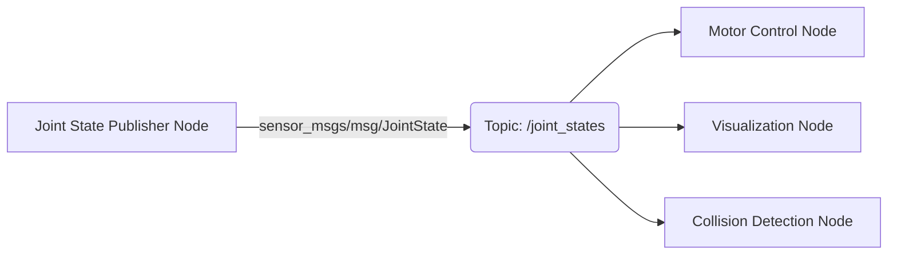
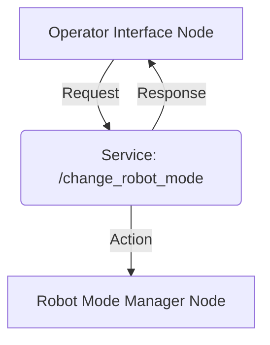

# ROS 2 Nodes, Topics, and Services

## The Building Blocks of a Robotic System

In ROS 2, the robotic nervous system is constructed from a network of interconnected components that communicate to achieve complex tasks. The fundamental building blocks are Nodes, Topics, and Services, which together form a powerful and flexible communication architecture.

## Nodes: The Workers of ROS 2

A **Node** is an executable process that performs computation. In a robotic system, each node is responsible for a specific, modular task. This modularity is a core tenet of ROS 2, allowing for easier development, debugging, and reuse of components.

**Examples of Nodes in a Humanoid Robot:**

*   **Camera Driver Node:** Publishes images from the robot's camera.
*   **Motor Control Node:** Receives commands and controls the robot's joints.
*   **Navigation Node:** Processes sensor data to determine the robot's position and plan paths.
*   **AI Perception Node:** Analyzes images to identify objects or faces.

Nodes can be written in various programming languages (e.g., Python with `rclpy`, C++ with `rclcpp`) and communicate without needing to know the implementation details of other nodes.

## Topics: Asynchronous Data Streaming

**Topics** provide a publish-subscribe mechanism for asynchronous data streaming. Nodes publish data to a topic, and other nodes subscribe to that topic to receive the data. This is ideal for continuous streams of information, such as sensor readings, joint states, or diagnostic messages.

### How Topics Work:

*   **Publisher:** A node that sends messages to a topic.
*   **Subscriber:** A node that receives messages from a topic.
*   **Message Type:** Every topic has a defined message type (e.g., `sensor_msgs/msg/Image`, `std_msgs/msg/String`, `geometry_msgs/msg/Twist`). This ensures that publishers and subscribers agree on the format of the data being exchanged.

### Example: Humanoid Robot Joint States

A common use case in humanoid robotics is publishing joint states. A `joint_state_publisher` node might publish `sensor_msgs/msg/JointState` messages to a `/joint_states` topic, which could then be subscribed to by a visualization tool, a motor controller, or a collision detection node.

## Services: Synchronous Request-Response

**Services** provide a synchronous request-response mechanism, similar to a function call. A client node sends a request to a service, and a server node performs an action and sends back a response. Services are suitable for tasks that require a one-time operation and a direct result, such as triggering an action or querying information.

### How Services Work:

*   **Service Server:** A node that provides a service and waits for requests.
*   **Service Client:** A node that sends a request to a service and waits for a response.
*   **Service Type:** Similar to message types, service types define the structure of the request and response messages.

### Example: Changing Robot Mode

A humanoid robot might have a service to change its operational mode (e.g., from "idle" to "walking"). An `operator_interface` node could act as a client, requesting a change of mode from a `robot_mode_manager` node, which acts as the service server.

## Key Takeaways

*   **Nodes** are modular executable processes performing specific tasks in ROS 2.
*   **Topics** facilitate asynchronous data streaming using a publish-subscribe model, ideal for continuous data like sensor readings.
*   **Services** enable synchronous request-response interactions for one-time operations and direct results, like changing a robot's state.
*   The combination of Nodes, Topics, and Services forms the flexible and scalable communication backbone for complex robotic systems, especially humanoids.