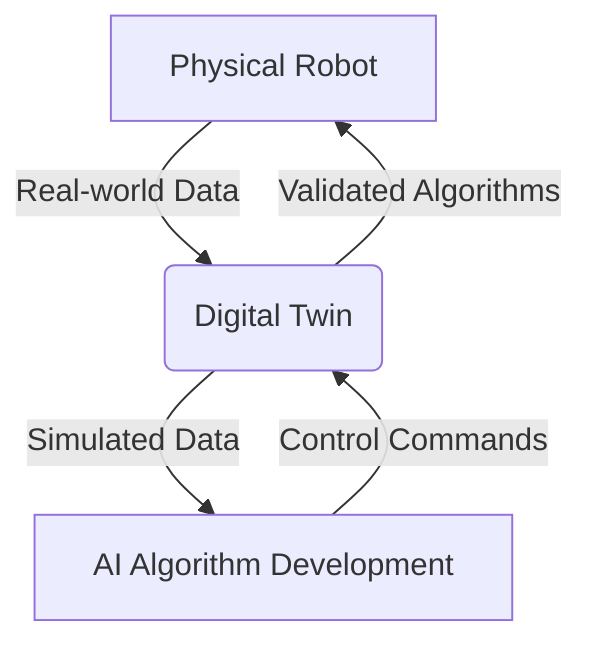

# Digital Twins in Physical AI

## The Virtual Counterpart

In the realm of Physical AI, a **Digital Twin** is a high-fidelity virtual representation of a physical robot and its operating environment. It serves as a dynamic, digital counterpart that mirrors the real world in every crucial aspect, from physics and sensors to kinematics and aesthetics. This virtual replica is not just a static model; it is a live, data-driven simulation that evolves in real-time alongside its physical twin.

## Why are Digital Twins Essential for Humanoid Robotics?

Developing algorithms for humanoid robots directly on physical hardware is often impractical, dangerous, and expensive. Digital twins provide a safe, scalable, and cost-effective solution for a wide range of development tasks:

*   **Algorithm Development & Testing:** AI agents, especially those based on reinforcement learning, can be trained for millions of simulation cycles without any risk of damaging the physical robot.
*   **Safety Validation:** Extreme conditions and failure scenarios can be tested in simulation to ensure the robot behaves predictably and safely in the real world.
*   **Remote Operation & Monitoring:** A digital twin can provide a detailed, real-time visualization of a robot's state and environment, enabling remote operators to make informed decisions.
*   **Synthetic Data Generation:** High-fidelity simulations can generate vast amounts of labeled sensor data (e.g., camera images with perfect object masks, lidar point clouds with precise distance measurements) to train perception models.
*   **Predictive Maintenance:** By simulating wear and tear based on real-world usage data, a digital twin can predict when physical components may require maintenance or replacement.

## Core Components of a Digital Twin

A comprehensive digital twin for a humanoid robot consists of several key components:

### 1. The Robot Model

This is a detailed virtual representation of the robot, typically based on its URDF (Unified Robot Description Format) or a similar format. It includes:

*   **Kinematics:** The robot's joint structure and degrees of freedom.
*   **Dynamics:** Mass, inertia, and friction properties of each link.
*   **Visuals:** Realistic meshes and textures that match the physical robot.
*   **Collision Models:** Geometries used for physics simulation and collision detection.

### 2. The Physics Engine

The physics engine is responsible for simulating the laws of physics, ensuring that the robot and its environment behave realistically. This includes:

*   **Gravity:** The effect of gravity on the robot's body.
*   **Contact Dynamics:** How the robot interacts with the ground and other objects (e.g., friction, bouncing).
*   **Joint Constraints:** Enforcing the limits of the robot's joints.

### 3. The Simulated Environment

The environment is a virtual replica of the robot's intended workspace. This can range from a simple, flat plane to a complex, fully furnished room or an outdoor scene. A realistic environment is crucial for testing navigation, manipulation, and human-robot interaction.

### 4. Simulated Sensors

The digital twin must be able to generate synthetic data that mimics the output of the robot's real sensors. This includes:

*   **Cameras:** Generating realistic images, including lighting, shadows, and textures.
*   **Lidar:** Simulating laser scans to produce point cloud data.
*   **IMUs (Inertial Measurement Units):** Simulating accelerometer and gyroscope readings.
*   **Force/Torque Sensors:** Simulating contact forces, for example, in the robot's feet or grippers.

## Gazebo and Unity: Two Pillars of Robotic Simulation

In this module, we will explore two of the most powerful and widely used platforms for creating digital twins in robotics:

*   **Gazebo:** A robust, open-source 3D robotics simulator with a strong focus on realistic physics and sensor simulation. It is tightly integrated with ROS and is a standard tool in the robotics community.
*   **Unity:** A popular real-time 3D development platform (game engine) that offers stunning visual quality, a user-friendly editor, and a growing ecosystem of tools for robotics simulation. Unity is particularly well-suited for applications requiring high-fidelity graphics and complex human-robot interaction scenarios.

## Key Takeaways

*   A **Digital Twin** is a dynamic, high-fidelity virtual model of a physical robot and its environment.
*   Digital twins are essential for safe algorithm development, testing, validation, and synthetic data generation in humanoid robotics.
*   Core components include a detailed robot model, a realistic physics engine, a simulated environment, and accurate sensor simulations.
*   **Gazebo** and **Unity** are leading platforms for building digital twins, each with unique strengths in physics simulation and visual fidelity, respectively.