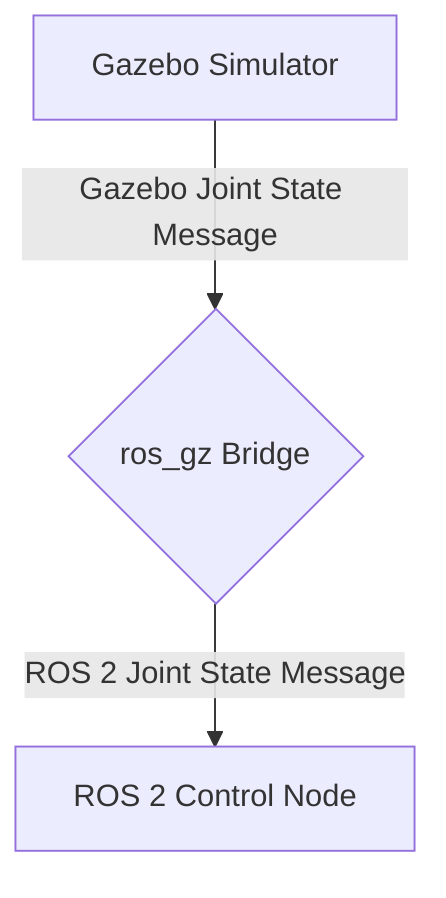

# Physics Simulation in Gazebo

## Gazebo: The Robotics Simulator

Gazebo is a powerful, open-source 3D robotics simulator that is widely used in research, education, and industry. Its key strength lies in its ability to accurately simulate the physics of robots and their interaction with the environment. Gazebo is designed to be tightly integrated with ROS, making it an essential tool for developing and testing ROS-based robotic systems, including humanoids.

## Core Features of Gazebo for Humanoid Robotics

*   **Multiple Physics Engines:** Gazebo supports several high-performance physics engines, including ODE (Open Dynamics Engine), Bullet, Simbody, and DART. This allows developers to choose the engine that best suits their specific needs for accuracy, speed, and stability.
*   **Realistic Sensor Simulation:** Gazebo provides a wide range of sensor models, from cameras and lidar to IMUs and force-torque sensors. These models can be customized to simulate noise and other real-world imperfections.
*   **ROS Integration:** Gazebo offers seamless integration with ROS 2 through the `ros_gz` bridge. This allows ROS 2 nodes to publish commands to the simulated robot and subscribe to its sensor data, just as they would with a physical robot.
*   **World Building:** Gazebo provides tools to create complex and realistic environments, either through its graphical interface or by writing SDF (Simulation Description Format) files.
*   **Extensibility:** Gazebo's plugin architecture allows developers to create custom plugins to model new sensors, actuators, or environmental effects.

## The Simulation Description Format (SDF)

While URDF (as discussed in Module 1) is excellent for describing a robot's kinematics and visual appearance, Gazebo uses SDF to describe the entire simulation world, including the robot, the environment, lighting, physics properties, and more.

SDF is an XML format that is a superset of URDF. It includes many additional tags for simulation-specific properties, such as:

*   **`<world>`:** The root element of an SDF file, which contains all the models, lights, and physics properties of the simulation.
*   **`<model>`:** Represents a physical object in the world, such as a robot, a table, or a building.
*   **`<link>`:** A rigid body within a model. In addition to visual and collision properties, SDF links can have detailed physics properties like friction and damping.
*   **`<joint>`:** Connects two links. SDF joints can have detailed properties like damping and friction.
*   **`<sensor>`:** Defines a sensor and its properties, such as update rate, noise, and visualization options.
*   **`<plugin>`:** Loads a custom plugin to extend Gazebo's functionality.

A common workflow is to use a main URDF/Xacro file to define the robot's core structure and then use a separate SDF file or Gazebo-specific tags within the URDF to add simulation-specific details.

### Example: Adding a Gazebo-specific tag to a URDF

```xml
<link name="foot">
  ...
</link>

<gazebo reference="foot">
  <material>Gazebo/Grey</material>
  <mu1>1.0</mu1>
  <mu2>1.0</mu2>
  <selfCollide>false</selfCollide>
</gazebo>
```
*   **`reference`**: Specifies the link to which these properties apply.
*   **`material`**: Sets the color and texture of the link in Gazebo.
*   **`mu1`, `mu2`**: Define the friction coefficients for the contact surface.
*   **`selfCollide`**: Specifies whether the link can collide with other links in the same model.

## The `ros_gz` Bridge: Connecting ROS 2 and Gazebo

The `ros_gz` bridge is a key component that allows ROS 2 and Gazebo (specifically, the modern Gazebo Sim, a successor to the classic Gazebo) to communicate. It acts as a bidirectional bridge, translating messages between ROS 2's DDS (Data Distribution Service) middleware and Gazebo's own transport layer.

This enables a clean separation of concerns:

*   **Gazebo:** Handles the physics simulation, sensor data generation, and rendering.
*   **ROS 2:** Manages the high-level control logic, AI algorithms, and communication between nodes.

### Example: Bridging a Joint State Topic

To get joint state information from a simulated robot in Gazebo to a ROS 2 node, you would configure the `ros_gz` bridge to forward messages from Gazebo's `/joint_states` topic to ROS 2's `/joint_states` topic.



## Practical Considerations for Humanoid Simulation

Simulating humanoid robots in Gazebo presents several challenges:

*   **Contact Stability:** Humanoid robots are bipedal, making them inherently unstable. Accurately simulating the contact forces between the feet and the ground is crucial for stable walking and balancing. This often requires careful tuning of the physics engine parameters.
*   **Computational Cost:** A high-fidelity simulation of a complex humanoid robot with many joints and sensors can be computationally expensive. It's often necessary to find a balance between realism and simulation speed.
*   **Sim-to-Real Gap:** Despite Gazebo's accuracy, there will always be a "sim-to-real gap"—a difference between how the robot behaves in simulation and in the real world. Techniques like domain randomization (varying simulation parameters like friction and mass) can help create more robust control policies that transfer better to the physical robot.

## Key Takeaways

*   **Gazebo** is a powerful open-source simulator for robotics, with a strong emphasis on realistic physics simulation.
*   **SDF (Simulation Description Format)** is used to define the entire simulation world, including robots, environments, and physics properties.
*   The **`ros_gz` bridge** enables seamless communication between Gazebo and ROS 2, allowing for a clean separation of simulation and control logic.
*   Simulating humanoids in Gazebo requires careful attention to contact stability, computational cost, and the sim-to-real gap.
*   Gazebo provides an essential platform for developing and testing humanoid robot control algorithms in a safe and controlled environment.