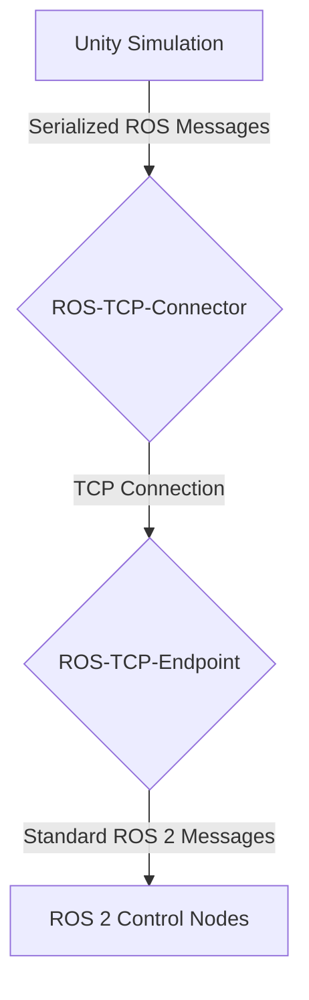

# Human-Robot Interaction in Unity

## Unity: Beyond Gaming

Unity is a powerful real-time 3D development platform, widely known for creating video games. However, its capabilities extend far beyond entertainment. Unity's high-fidelity graphics, intuitive editor, and robust physics engine make it an excellent choice for robotics simulation, particularly for applications involving complex environments and human-robot interaction (HRI).

## Why Unity for HRI Simulation?

While Gazebo excels at physics-based robotics simulation, Unity offers several advantages for HRI research and development:

*   **Photorealistic Graphics:** Unity's advanced rendering pipeline can create highly realistic environments and human avatars, which is crucial for studying how humans perceive and interact with robots.
*   **Rich Asset Ecosystem:** The Unity Asset Store provides a vast library of pre-made 3D models, characters, animations, and environments, enabling rapid prototyping of complex HRI scenarios.
*   **Intuitive Scene Building:** Unity's visual editor makes it easy to design and modify simulation worlds, place objects, and script events, without needing to write extensive XML code.
*   **VR/AR Integration:** Unity is a leading platform for developing virtual reality (VR) and augmented reality (AR) applications. This allows researchers to create immersive HRI experiments where users can interact with virtual robots in a natural and intuitive way.
*   **C# Scripting:** Unity uses C# for scripting, a powerful and modern object-oriented language that is well-suited for developing complex HRI logic and user interfaces.

## The Unity Robotics Hub

To facilitate the use of Unity for robotics simulation, Unity has developed the **Unity Robotics Hub**, a set of open-source packages that integrate Unity with ROS. The key components of the Robotics Hub are:

*   **`ROS-TCP-Connector`:** This package handles the low-level TCP connection between Unity and a ROS 2 network. It allows Unity to act as a node in the ROS graph, subscribing to and publishing messages.
*   **`URDF-Importer`:** This tool allows you to import a URDF file into Unity, automatically creating a C# class and a hierarchy of GameObjects that represent the robot's links and joints. It also handles the configuration of the robot's ArticulationBody components, which are Unity's specialized physics components for robotic arms and kinematic chains.
*   **`ROS-TCP-Endpoint`:** A ROS package that runs on the ROS side of the connection, managing the communication with the Unity simulation.

### How it Works:

The `ROS-TCP-Connector` establishes a direct TCP connection to the `ROS-TCP-Endpoint` running on the ROS machine. ROS messages are then serialized and sent over this connection, allowing Unity to communicate with any node in the ROS 2 ecosystem.

## ArticulationBody: Unity's Physics for Robots

For simulating the physics of complex robotic arms and humanoids, Unity provides a specialized component called **ArticulationBody**. Unlike standard Rigidbody physics, which can be unstable for complex joint chains, ArticulationBody is designed to handle the unique dynamics of articulated robots.

**Key features of ArticulationBody:**

*   **Reduced Coordinate Representation:** It uses a more efficient and stable method to represent the state of the robot, which avoids many of the instability issues found in traditional physics engines.
*   **Direct Actuation:** It allows you to directly control the forces, torques, and target positions of the joints, which is how real robotic control systems operate.
*   **Stable Joint Constraints:** It provides robust and stable enforcement of joint limits and other constraints.

When you import a URDF into Unity using the Robotics Hub, each link in the robot is typically assigned an ArticulationBody component, forming a complete articulated physics model of the robot.

## Building HRI Scenarios

Unity's strengths shine when building scenarios to test how a humanoid robot interacts with people and its environment. For example, you could:

*   **Simulate a Shared Workspace:** Create a virtual factory floor or office where a humanoid robot must work alongside human avatars. You can then test the robot's ability to navigate around people, avoid collisions, and respond to human gestures or commands.
*   **Develop Intuitive Interfaces:** Use Unity's UI tools to create on-screen displays or VR interfaces that allow a human operator to control or collaborate with the robot.
*   **Study Social Robotics:** Use realistic human avatars and animations to study how a robot's appearance and behavior affect a human's trust and acceptance of the robot.

## Key Takeaways

*   **Unity** is a powerful real-time 3D platform with high-fidelity graphics, making it ideal for HRI simulation.
*   The **Unity Robotics Hub** provides open-source tools to integrate Unity with ROS 2, allowing for seamless communication between the simulation and control nodes.
*   **`ROS-TCP-Connector`** and **`URDF-Importer`** are key components for bringing ROS-enabled robots into the Unity environment.
*   **ArticulationBody** is Unity's specialized physics component for creating stable and realistic simulations of articulated robots like humanoids.
*   Unity's rich asset ecosystem and intuitive editor enable the rapid creation of complex and immersive HRI scenarios, including those in VR and AR.