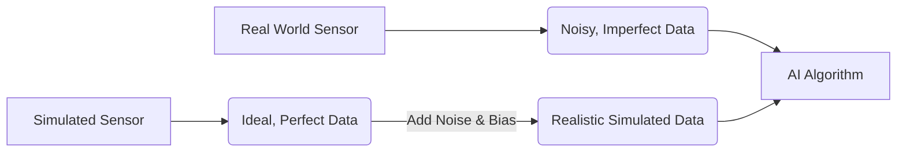

# Sensor Simulation for Humanoid Robots

## The Senses of a Digital Twin

A digital twin's ability to mirror its physical counterpart depends entirely on the quality of its simulated sensors. For a humanoid robot to perceive its virtual environment, it needs a suite of sensors that produce data as close as possible to the real thing. This simulated sensor data is the lifeblood of AI algorithms, providing the necessary input for perception, navigation, and decision-making.

Both Gazebo and Unity provide powerful tools for simulating a wide range of sensors, each with its own strengths and use cases.

## Common Sensor Types and Their Simulation

### 1. Cameras

Cameras are the primary visual sensors for most humanoid robots. Simulating a camera involves rendering the 3D scene from the camera's perspective to create a 2D image.

**Simulation in Gazebo:**
*   Uses a `<sensor type="camera">` tag in the robot's SDF/URDF.
*   Highly configurable, allowing you to specify image resolution, frame rate, lens distortion, and camera intrinsics.
*   Can be connected to a `gazebo_ros_camera` plugin to publish images directly to a ROS topic.

**Simulation in Unity:**
*   Uses Unity's built-in Camera GameObject.
*   Can leverage Unity's advanced rendering pipelines (like the High Definition Render Pipeline, HDRP) to produce photorealistic images.
*   The `ROS-TCP-Connector` can be used to capture rendered images and publish them to a ROS topic.

### 2. Lidar (Light Detection and Ranging)

Lidar sensors use lasers to measure distances, creating a 3D point cloud of the environment. They are crucial for mapping, localization, and obstacle avoidance.

**Simulation in Gazebo:**
*   Uses `<sensor type="ray">` or `<sensor type="gpu_ray">` for GPU-accelerated performance.
*   Simulates by casting a series of rays into the environment and measuring the distance to the first object hit.
*   Can be configured to match the number of lasers, angular resolution, range, and noise characteristics of a real lidar sensor.
*   The `gazebo_ros_lidar` plugin publishes the resulting point cloud as a `sensor_msgs/msg/PointCloud2` message.

**Simulation in Unity:**
*   Can be implemented using C# scripts that perform a series of raycasts.
*   The Unity Robotics Hub provides a `RosLidarSensor` script that simplifies this process.
*   Leverages Unity's physics engine for raycasting, which can be very fast and efficient.

### 3. IMU (Inertial Measurement Unit)

IMUs measure a robot's orientation, angular velocity, and linear acceleration. They are essential for balance and state estimation.

**Simulation in Gazebo:**
*   Uses a `<sensor type="imu">` tag.
*   Directly accesses the physics engine's ground truth data for the link's orientation and motion.
*   Provides options to add realistic noise (e.g., Gaussian noise, random walk bias) to the sensor readings.
*   The `gazebo_ros_imu_sensor` plugin publishes data as a `sensor_msgs/msg/Imu` message.

**Simulation in Unity:**
*   The `RosImuSensor` script in the Unity Robotics Hub can be attached to a link.
*   It calculates the orientation, velocity, and acceleration based on the ArticulationBody's state.
*   Noise can be added programmatically in the C# script.

### 4. Force/Torque Sensors

These sensors measure the forces and torques applied to a specific link, such as the robot's wrist or ankle. They are vital for tasks involving physical contact, like grasping objects or maintaining balance.

**Simulation in Gazebo:**
*   Uses a `<sensor type="force_torque">` tag.
*   Measures the forces and torques at the joint connecting the sensor to its parent link.
*   The `gazebo_ros_ft_sensor` plugin publishes data as a `geometry_msgs/msg/WrenchStamped` message.

**Simulation in Unity:**
*   The ArticulationBody API provides access to the forces and torques acting on each joint.
*   A C# script can read these values and publish them as ROS messages.

## The Importance of Realistic Noise

Real-world sensors are not perfect. Their readings are affected by noise, bias, and other imperfections. To bridge the "sim-to-real" gap, it's crucial to model these imperfections in the simulation.

*   **Gaussian Noise:** A common type of noise that can be added to sensor readings to simulate random fluctuations.
*   **Bias:** A systematic offset in the sensor's readings.
*   **Domain Randomization:** A technique where the simulation parameters (including sensor noise, lighting, object textures, etc.) are varied randomly during training. This forces the AI agent to learn a more robust policy that is less sensitive to the specific characteristics of the simulation, making it more likely to work on the physical robot.

## Key Takeaways

*   Accurate sensor simulation is fundamental to creating effective digital twins for Physical AI.
*   **Gazebo** and **Unity** both provide comprehensive tools for simulating common robotic sensors like cameras, lidar, and IMUs.
*   Gazebo's sensor models are typically configured via SDF and integrated with ROS using plugins.
*   Unity's sensors are often implemented with C# scripts and integrated with ROS via the Unity Robotics Hub.
*   Modeling **realistic noise** and using techniques like **domain randomization** are crucial for bridging the sim-to-real gap and ensuring that algorithms trained in simulation will perform well on physical hardware.