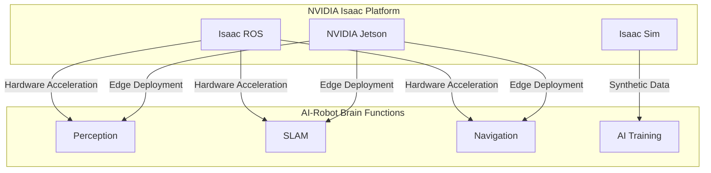

# The AI-Robot Brain

## From Middleware to Intelligence

Modules 1 and 2 established the "nervous system" (ROS 2) and "virtual body" (Digital Twin) of our humanoid robot. Now, we turn to the most critical component: the brain. The AI-Robot Brain is where perception, reasoning, and action converge. It processes torrents of sensor data, makes sense of the world, and generates the intelligent commands that drive the robot's behavior.

For the complex and computationally intensive tasks required by modern humanoid robotics, a specialized platform is needed—one that combines advanced simulation with hardware-accelerated AI. This is the domain of the **NVIDIA Isaac™ platform**.

## NVIDIA Isaac: The Platform for AI-Powered Robotics

NVIDIA Isaac is an end-to-end platform designed to accelerate the development, simulation, and deployment of AI-powered robots. It provides a suite of tools and technologies that are purpose-built for the challenges of Physical AI, leveraging NVIDIA's leadership in GPU technology to bring state-of-the-art AI to the physical world.

The core components of the Isaac platform that we will explore in this module are:

*   **Isaac Sim:** A robotics simulator built on NVIDIA Omniverse™, offering photorealistic visuals and physically accurate simulation, with a focus on generating synthetic data for training AI models.
*   **Isaac ROS:** A collection of hardware-accelerated packages for ROS 2 that leverage NVIDIA GPUs and specialized hardware (like the Jetson platform) to dramatically improve the performance of common robotics tasks.
*   **NVIDIA Jetson™:** A family of small, powerful, and energy-efficient computers designed to run AI applications at the edge, making them ideal for deployment on humanoid robots.

## Why NVIDIA Isaac for the Humanoid Brain?

Building a brain for a humanoid robot involves several major computational challenges:

1.  **Perception:** Processing high-resolution camera feeds, 3D lidar scans, and other sensor data in real-time to understand the environment. This often involves running deep learning models for object detection, segmentation, and depth estimation.
2.  **Localization and Mapping:** Simultaneously determining the robot's position within an environment and creating a map of that environment (a task known as SLAM).
3.  **Navigation and Planning:** Calculating safe and efficient paths for the robot to follow, taking into account its complex bipedal dynamics and the surrounding obstacles.
4.  **Training and Learning:** Many advanced robotic skills are learned, not just programmed. This requires training AI models, often through reinforcement learning, which demands massive amounts of data and computation.

NVIDIA Isaac is uniquely positioned to address these challenges:

*   **GPU Acceleration:** It leverages the parallel processing power of NVIDIA GPUs to accelerate everything from physics simulation and rendering to AI inference and perception algorithms. This is crucial for achieving the real-time performance required by humanoids.
*   **Physically-Based Simulation:** Isaac Sim is built on NVIDIA's PhysX 5, a highly advanced physics engine capable of simulating complex dynamics, including the contact forces and friction that are critical for bipedal locomotion.
*   **Sim-to-Real Focus:** The entire platform is designed to minimize the gap between simulation and reality. By providing photorealistic rendering and accurate physics, Isaac Sim enables the training of AI models that transfer more effectively to physical robots.
*   **ROS 2 Integration:** Isaac ROS provides a seamless bridge between the high-performance Isaac tools and the broader ROS ecosystem, allowing developers to leverage the best of both worlds.

## The Role of Hardware Acceleration

A key theme of this module is **hardware acceleration**. Many of the algorithms used in robotics, such as image processing, point cloud registration, and deep learning inference, are computationally intensive. Attempting to run these on a standard CPU in real-time is often impossible.

NVIDIA's GPUs and dedicated hardware like the Jetson platform provide specialized processing units that can perform these calculations orders of magnitude faster than a CPU. By offloading these tasks to the hardware, the CPU is freed up to manage the rest of the robotic system, leading to a more responsive and capable robot.

## Key Takeaways

*   The **AI-Robot Brain** is responsible for perception, reasoning, and generating intelligent actions.
*   The **NVIDIA Isaac** platform provides an end-to-end solution for building AI-powered robots, from simulation to deployment.
*   **Isaac Sim** offers photorealistic, physically accurate simulation for training AI models and generating synthetic data.
*   **Isaac ROS** provides hardware-accelerated packages that dramatically improve the performance of common ROS 2 perception and navigation tasks.
*   **Hardware acceleration** using NVIDIA GPUs and platforms like Jetson is essential for achieving the real-time performance required by complex humanoid robots.