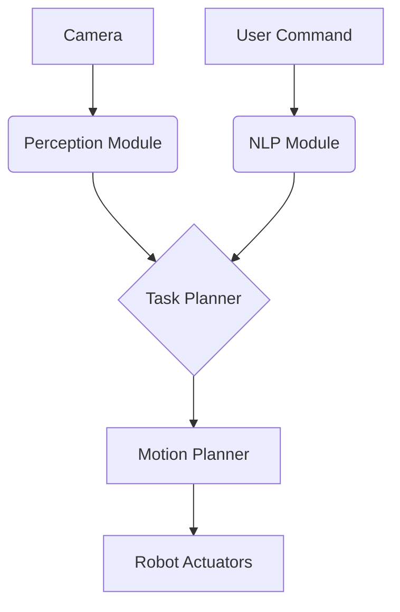
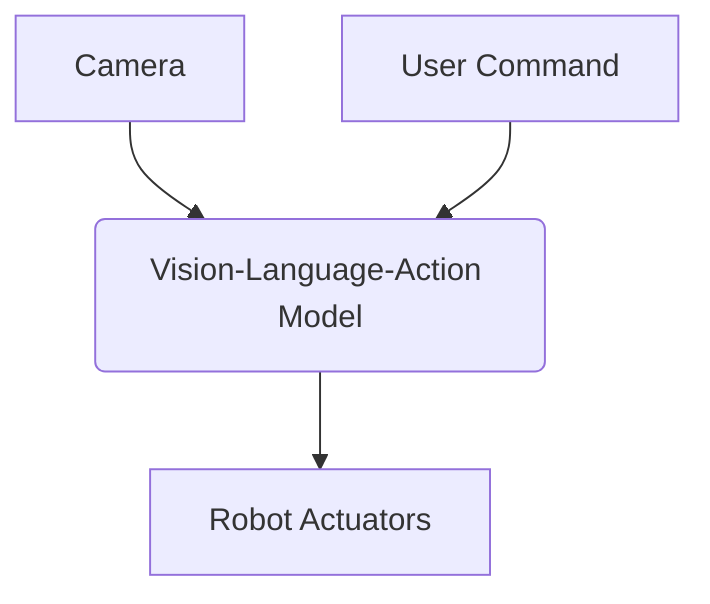

# Vision-Language-Action Systems in Physical AI

## The Next Frontier: Embodied Intelligence

So far, we have constructed the physical infrastructure of our humanoid robot: its nervous system (ROS 2), its digital twin (Gazebo/Unity), and its powerful, hardware-accelerated brain (NVIDIA Isaac). Now, we arrive at the final and most forward-looking frontier: enabling the robot to understand and interact with the world in a human-like way. This is the realm of **Vision-Language-Action (VLA)** systems, a revolutionary approach that seeks to connect what a robot *sees*, what it *understands* from human language, and what it *does* in the physical world.

## What are Vision-Language-Action (VLA) Systems?

VLAs, sometimes called Vision-Language-Models (VLMs) or Vision-Language-Action Models (VLAMs), represent the convergence of three traditionally separate fields of AI:

1.  **Computer Vision (Vision):** The ability to process and interpret visual information from the world (e.g., identifying objects, understanding scenes).
2.  **Natural Language Processing (Language):** The ability to understand and generate human language (e.g., following instructions, answering questions).
3.  **Robotics (Action):** The ability to plan and execute physical actions in the real world (e.g., grasping an object, navigating to a location).

A VLA system is a single, often end-to-end, model that takes in both visual data (from a camera) and language data (from a user's command) and outputs a sequence of actions for the robot to perform.

### The Core Idea:

Instead of having separate, specialized models for perception, planning, and control, a VLA aims to create a unified representation of the world that is grounded in both vision and language. This allows the robot to perform tasks that require a deep, contextual understanding of its environment and the user's intent.

**Traditional Approach:**

**VLA Approach:**

## Why VLAs are a Game-Changer for Humanoid Robotics

Humanoid robots are designed to operate in human-centric environments. To be truly useful, they must be able to understand our instructions, which are often ambiguous and context-dependent.

Consider the command: "**Can you get me the red apple from the counter?**"

A traditional robotics system would need to be explicitly programmed to:
1.  Recognize the object "apple".
2.  Recognize the color "red".
3.  Locate the "counter".
4.  Plan a path to the counter.
5.  Plan a grasp for the apple.
6.  Execute the grasp and return.

A VLA, on the other hand, learns a direct mapping from the combined vision (seeing the counter with apples) and language (the user's command) to the sequence of actions required to complete the task. This approach offers several key advantages:

*   **Generalization:** VLAs can often perform tasks they haven't been explicitly trained for, by leveraging the general knowledge embedded in their underlying Large Language Model (LLM). For example, if trained to pick up apples, a VLA might be able to figure out how to pick up a pear without additional training, because it understands the general concept of "picking up fruit."
*   **Natural Interaction:** Users can interact with the robot using everyday language, rather than needing to know a specific set of commands.
*   **Common Sense Reasoning:** By building on the foundation of powerful LLMs, VLAs can exhibit a form of "common sense" reasoning. For example, if asked to "heat up a cup of coffee," the robot might infer that it needs to place the cup in a microwave, even if it has never been explicitly told to do so.

## The Role of Foundation Models

The recent explosion in the capabilities of VLAs is largely due to the development of **foundation models**—massive, pre-trained models (like GPT-4, LLaMA, or PaLM) that have been trained on vast amounts of text and image data from the internet.

These models serve as the "brain" of the VLA, providing a rich, pre-existing understanding of the world. The process of creating a VLA typically involves:

1.  **Pre-training:** A foundation model is trained on a massive dataset of text and images.
2.  **Fine-tuning:** The pre-trained model is then fine-tuned on a more specific dataset of robot interaction data, which might include videos of robots performing tasks, paired with textual descriptions of those tasks.

This two-stage process allows the VLA to leverage the general knowledge of the foundation model while specializing it for the specific domain of robotics.

## The Path Forward: Challenges and Opportunities

While VLAs are incredibly promising, there are still many challenges to overcome:

*   **Data Scarcity:** High-quality robot interaction data for fine-tuning is still scarce and expensive to collect.
*   **Safety and Reliability:** Ensuring that a VLA-powered robot behaves safely and reliably in all situations is a major challenge.
*   **Real-time Performance:** Running these massive models in real-time on an embedded platform requires significant hardware acceleration and model optimization.

Despite these challenges, the rapid progress in this field suggests that VLA-powered humanoids are not a distant dream, but an emerging reality. This module will explore the key technologies and concepts that are making this future possible.

## Key Takeaways

*   **Vision-Language-Action (VLA)** systems represent a new paradigm in robotics, aiming to create a unified model that connects vision, language, and action.
*   VLAs enable more natural, human-like interaction with robots and allow them to generalize to new tasks and situations.
*   **Foundation models**, pre-trained on massive datasets, provide the "common sense" reasoning and world knowledge that underpins modern VLA systems.
*   The process of creating a VLA typically involves **pre-training** on a general dataset and **fine-tuning** on a specific robotics dataset.
*   While challenges remain in data scarcity, safety, and real-time performance, VLAs represent the future of intelligent, embodied AI.